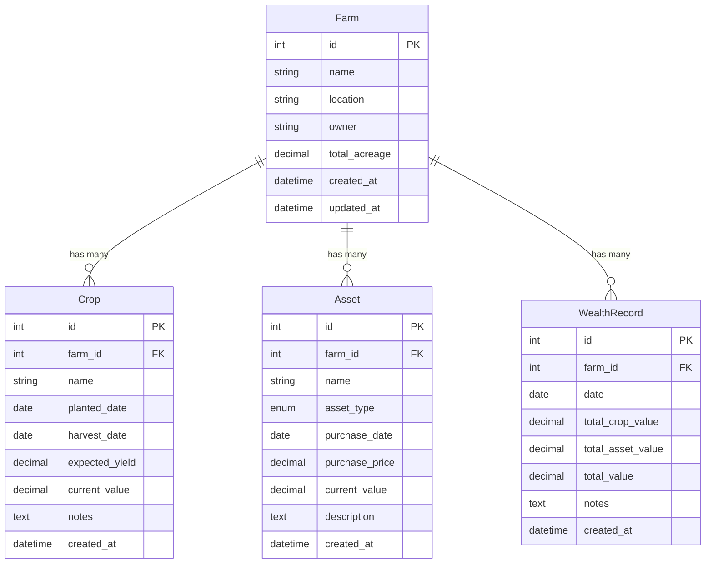
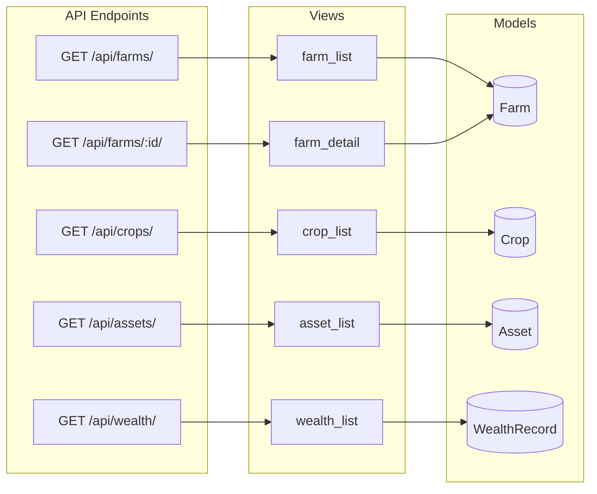
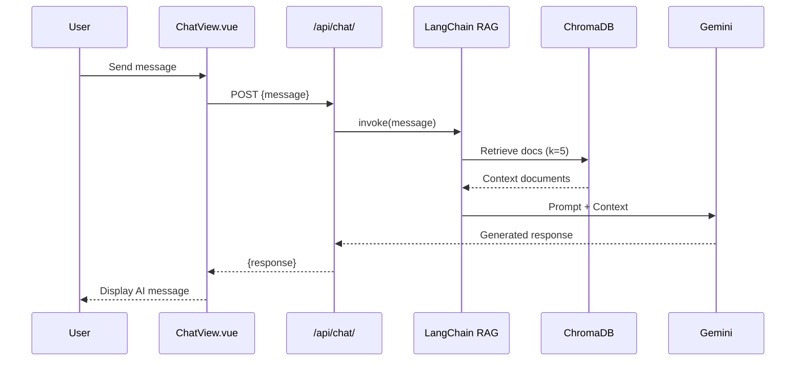

# FarmWise Architecture

## Database Schema

## API Routes

## Endpoints

| Method | Endpoint           | View          | Description         |
| ------ | ------------------ | ------------- | ------------------- |
| `GET`  | `/api/farms/`      | `farm_list`   | List all farms      |
| `GET`  | `/api/farms/<id>/` | `farm_detail` | Get farm details    |
| `GET`  | `/api/crops/`      | `crop_list`   | List all crops      |
| `GET`  | `/api/assets/`     | `asset_list`  | List all assets     |
| `GET`  | `/api/wealth/`     | `wealth_list` | List wealth records |
| `POST` | `/api/chat/`       | `chat`        | AI chat assistant   |

## Asset Types

| Value       | Display   |
| ----------- | --------- |
| `equipment` | Equipment |
| `land`      | Land      |
| `livestock` | Livestock |
| `building`  | Building  |
| `vehicle`   | Vehicle   |
| `other`     | Other     |

---

## AI Chat / RAG Flow

### Components

| Component    | File              | Purpose                                |
| ------------ | ----------------- | -------------------------------------- |
| LLM          | `services/llm.py` | Google Gemini 2.0 Flash                |
| RAG Chain    | `services/rag.py` | LCEL chain with retriever + prompt     |
| Embeddings   | `services/rag.py` | HuggingFace `all-MiniLM-L6-v2` (local) |
| Vector Store | `chroma_db/`      | ChromaDB                               |
| Frontend     | `ChatView.vue`    | Chat UI with markdown rendering        |
